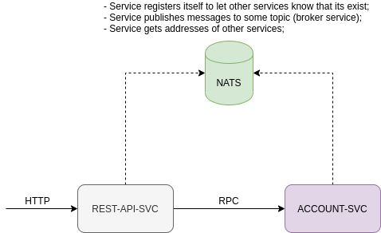
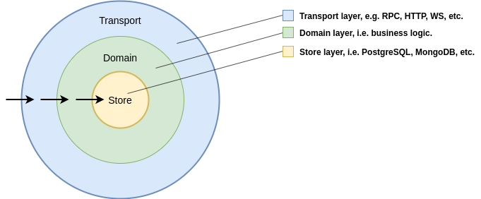

[go]: https://golang.org/doc/install
[gomicro]: https://github.com/micro/go-micro
[nats]: https://nats.io/
[docker]: https://www.docker.com/
[dockercompose]: https://docs.docker.com/compose/
[gomodules]: https://blog.golang.org/using-go-modules
[protoc]: https://github.com/google/protobuf/releases
[swagger]: https://swagger.io/

*NOTE 1: If something is not fully clear, feel free to create an issue. 
Let's create an excellent boilerplate together!*

*NOTE 2: There are no tests in the project, this is a different story :)*

# Go Micro Boilerplate

Go Micro Boilerplate is the example of the [GoLang][go] project based on the microservices architecture.

This project provides simple functionality to perform CRUD operations related to the user entity.

There are two microservices, one web service that exposes REST API, 
and the second one is the RPC microservice that implements functionality to work with users, 
basically this service is responsible for the business logic. 

Once a user sends an HTTP request to the web service, it handles the incoming request, prepares data
and calls the RPC service through RPC request using protobuf models.
The RPC service handles this request, applies some business logic, and updates/reads the data store.

### Technologies

[Go Micro][gomicro] framework provides the core requirements for distributed systems development 
including RPC and Event driven communication.
Read more about this framework on their official [GitHub page][gomicro].


We use [NATS][nats] as a discovery service, message broker service, and transport channel.

All services are [dockerized][docker] and can be adjusted by [docker-compose][dockercompose] configuration.
Check Dockerfiles and docker-compose.yaml file in the root of the project.

Use [Go modules][gomodules] to manage dependencies of the project. 

[Swagger][swagger] is used to define the REST API of the platform. 
It's really easy to maintain your REST API logic using this tool. 
Review it in `rest-api-svc` service.

### Install [protoc][protoc]

Use Protobufs as part of our toolchain so you need to [grab a release][protoc] 
from upstream before you can create a project. 
On macOS you can do this with just `brew install protobuf`, if you'd like.
On Linux try to do the following:
```bash
$ cd ./~
$ export PROTOBUF_VERSION=3.11.4
$ curl -sOL "https://github.com/google/protobuf/releases/download/v${PROTOBUF_VERSION}/protoc-${PROTOBUF_VERSION}-linux-x86_64.zip" && \
$ unzip protoc-*.zip              && \
$ mv bin/protoc /usr/local/bin    && \
$ mv include/* /usr/local/include && \
$ rm -f protoc-*.zip
```

### Install other go tools

There are a few other go tools that are needed to develop and build the project.
Open your terminal and execute the following command:
```bash
$ go install \
    github.com/go-openapi/runtime \
    github.com/tylerb/graceful \
    github.com/jessevdk/go-flags \
    github.com/micro/protoc-gen-micro \
    github.com/golang/protobuf/protoc-gen-go \
    github.com/go-swagger/go-swagger/cmd/swagger
```


### Run locally

To run services locally you have to install [docker][docker] and [docker-compose][dockercompose]. 

Once it's done, you have to build the base image:
```bash
$ ./scripts/build-base-image.sh
```
This is needed to prepare common things for all services to avoid doing the same work multiple times.

Now you have to use the following command to build and start all services:
```bash
$ docker-compose up -d --build
```

To stop services use:
```bash
$ docker-compose stop
```

### Structure of the project:

This section describes and explains the files and directories structure of the project. 

#### `./proto` directory

Contains protocol buffers models of each service where it exists.
Your services use protocol buffer messages as the main communication objects.

#### `./scripts` directory

Contains bash scripts. 

You may see `generate.sh` scripts there. This is needed to generate some stuff like 
GoLang models of proto messages and swagger models.
To generate these data, execute the following command from the root of the project 
```bash
$ ./scripts/generate.sh .
```

We've prepared docker image as a base image of services.
To build the base image, you have to execute `build-base-image.sh` script:
```bash
$ ./scripts/build-base-image.sh
```

#### `./services` directory
 
Contains all services of the project.

Once you want to create a new service, you may create a new directory with `<service-name>-svc` format.
Inside of the created directory you can put the logic of your service like it's done with `account-svc`.
 
#### `./utils` directory
 
Contains common packages used across the services.

#### `./vendor` directory (git ignored)

Contains dependencies. Execute the following from the root of the project to setup `vendor`:
```bash
$ export GO111MODULE=on
$ go mod download
$ go mod vendor
```

#### `./docker-compose.yaml` directory
 
Contains configuration of services to run inside docker containers.
If you want to add a new service there, you can use the way how it's done with `account-svc`.
Useful commands:
- `docker-compose up -d --build` - restart all services.
- `docker-compose up -d --build <service-name>` - restart a certain service.
- `docker-compose down` - destroy all services. All data will be removed.
- `docker-compose stop` - stop all services.
    
#### `./go.mod` and `./go.sum` files
 
These files are needed to manage dependencies using [go modules][gomodules].
When you add/remove dependency from the project, these files gonna be modified.

#### `./.env` file
 
This contains environment variables that pass to services 
when we run them using docker-compose (see `docker-compose.yaml`).


#### `./README.md` file
 
This is recommended to describe your project.

## Structure of services



This section describes and explains architecture of microservices both web and RPC.
All services should be in `./services` directory. Use `<servicename>-svc` format to name services.

There are two microservices in this project:

- `rest-api-svc` is the web service that exposes REST endpoints. 
    It allows users to perform operations in other services.
    You can serve Swagger UI by doing the following:
    ```bash
    $ docker-compose up -d cvspot-api-spec  
    ```
    And open `localhost:4005` after that command. 

- `account-svc` is the RPC microservice that provides some business logic related to users.


### Structure of an RPC service:

As an example, `account-svc` is described below.



There are 3 layers:

- **Transport layer** represents the API of the service. 
    It can be implemented using HTTP, RPC, WS, etc. 
    This layer prepares and passes data to pass to the service layer.
    No business logic inside of this layer.

- **Domain/business layer** represents the business/domain logic of the service. 
    This layer doesn't care about transport and must not depend on it.
    All business logic must be implemented in this layer.

- **Store layer** represents the behavior of the data store. 
    It can be implemented using PostgreSQL, MongoDB, etc. databases, this is the internal implementation.
    Only store layer knows about the kind of database inside.
    A data just come from the outside of this layer. No business logic inside of this layer.

The most important thing about clean architecture is to make interfaces through each layer.
Don't build dependencies on implementations, use interfaces instead.
Each of these layers has its own interface that describes the behavior of it.

- `Dockerfile` is the dockerfile of the service.
- `entrypoint.sh` is the entrypoint script of the service. 
    This script can load some external data like secrets, passwords, etc.
- `handler.go` implements proto service interface defined in the proto model of a service.
    This is the transport layer of the service.
- `domain` contains the business logic.
- `store` is the store layer.
- `microservice` implements functionality to setup and configure your microservice. 
    No business logic inside.
- `cmd` contains the main package.

### Structure of web service:

As an example, `rest-api-svc` is described below.

This service provides REST API to users. Requests from users are handled by `rest-api-svc`
and redirected to other RPC services.

We use [Swagger][swagger] to describe REST API of the project.

- `Dockerfile` is the dockerfile of the service.
- `entrypoint.sh` is the entrypoint script of the service. 
    This script can load some external data like secrets, passwords, etc.
- `handler.go` sets up the swagger API of the service.
- `swaggergen` contains generated Swagger models.
- `specs` contains Swagger file that describes REST API of the project.
- `microservice` implements functionality to setup and configure your microservice. 
    No business logic inside.
- `cmd` contains the main package.
- `account` contains handlers of endpoints that are related to the account logic.

## Inspired by

- [GoLang][go]
- [Go Micro][gomicro]
- [NATS][nats]
- [Docker][docker]
- [docker-compose][dockercompose]
- [Swagger][swagger]

## TODO

- Add a cli tool to generate a simple microservice. It will be in a new repo.
- Add protected endpoints. 
- Add example of usage of postgres, and redis.


Donate ETH: 0xc81A7a2b1bbC8D0CD09bf7eBdB8ac5A635711B5f
